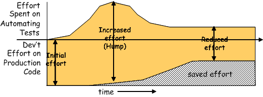
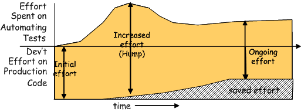

name: goals-header
layout: true

# Goals of Test Automation

---
template: goals-header

## Why Test

### Challenges
* Writing good test code **is hard** and maintaining bad test code is even harder
* Since test code is **not what the customer is paying for**, there is a strong temptation to give up testing when the tests becomes difficult or expensive to maintain

### Motivation
* Adherence to the **goals** (things to achieve) and **principles** (ways to achieve them) will result in automated **tests that are easier to write, read, and maintain**

---
template: goals-header
name: goals-economics-header
layout: true

## Economics

---
template: goals-economics-header

### The invesment

* There is will always be a cost to building and maintaining an automated test suite. 
* It is worth spending more to have the ability to change the software later.
* Test automation should be a "no-brainer".

### The benefit

* The additional cost of building and maintaining automated tests must be offset by savings through reduced manual unit testing and debugging/troubleshooting
* As well as the remediation cost of the defects that would have gone undetected

---
template: goals-economics-header

### A good Return of Investment

.center[]

The cost of learning the new technology and practices takes additional effort but once we get past the "hump", we should settle down to a steady stage where the added cost (the part above the line) is at least fully offset by the savings (the part below the line).

---
template: goals-economics-header

### A poor Return of Investment

.center[]

If tests are hard to write, hard to understand and require frequent, expensive maintenance, the total cost of software development (the heights of the vertical arrows) goes up. This results in the increase in overall effort which now exceeds the original effort without test automation.

---
template: goals-header
name: goals-goals-header
layout: true

## Goals

---
template: goals-goals-header

### Improve quality

* **Tests as Specification**
	* Understand requirements
* **Preventing Bugs**
* **Defect Localization**
	* Why some expected behavior isn't working

### Understand the system under test (SUT)

* **Tests as Documentation**
	* Tell us what should be the result for a given condition
	* Executable

---
template: goals-goals-header

### Reduce (and not introduce) risk

* **Tests as Safety Net**
	* Make changes to code with less risk
* **Do No Harm**
	* Keep Test Logic out of Production Code
	* Believing that some code is reliable because it has been well tested when in fact it has not

### Tests easy to run

* **Fully Automated Test**
* **Self-Checking Test**
* **Repeatable Test**

---
template: goals-goals-header

### Tests easy to write and maintain

* **Simple Tests**
* **Expressive Tests**
* **Separation of Concerns**

### Tests that require minimal maintenance as the system evolves

* **Robust Test**
	* Verify One Condition per Test
	* Test Utility Methods

---
layout: true