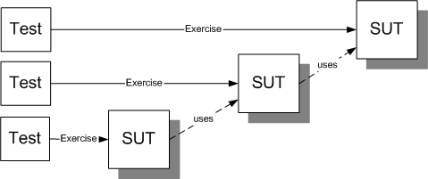
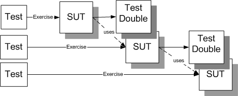

name: philosophy-header
layout: true

# Philosophy

---
template: philosophy-header

## Test First or Last?

### Test First
 
* The system is **inherently testable**.
* **Only enough code is written** to make the tests pass.
* Code tends to be more minimalist.
* Substitute dependencies with Test Doubles is enhanced.

### Test Last

* **Retrofit unit tests is hard** whether or not it is easy to do.
* Cannot write tests **without modifying production code**.

---
template: philosophy-header

## Test-by-Test or All-At-Once?

### Test-by-Test

* TDD process is "write a test" then "write some code".
* Incremental development at its finest grain.
* **Cannot focus** completely on one of both tasks (test or code).

### All-At-Once

Identify all the tests needed **before** starting any coding

* Think like a **client or tester**.
* Avoid being sucked in **solution mode** too early.
* Write a **single test body** at a time.

---
template: philosophy-header
name: philosophy-outside-in-inside-out-header
layout: true

## Outside-In or Inside-Out?

---
template: philosophy-outside-in-inside-out-header

### Design Outside-In and code Inside-Out

* Avoids the "dependency problem".
* Requires anticipating the needs of the outer software for the inner software.
* Avoids the needs for Test Stubs or Mock Objects in many of the tests.

.center[] 

---
template: philosophy-outside-in-inside-out-header

### Design and code Outside-In

* Forces us to deal with the "dependency problem".
* Allows us to layer our SUT and use Test Doubles sparingly.
* Helps clarify what tests are needed for the next layer inwards.

.center[] 

---
template: philosophy-header

## State or Behavior Verification?

### State verification

* Put the SUT into specific state.
* Exercise it.
* Verify that it is in the expected state.

### Behavior verification

* Specify the calls that the SUT makes to its dependencies.
* Copious usage of Mock Objects or Test Spys.
* Provides better isolation of each test unit at a possible cost of more difficult refactoring.

---
template: philosophy-header

## Fixture Design Up Front or Test-by-Test?

### Fixture Design Up Front 

* Define a "test bed" with a variety of test data.
* Use a **Standard Fixture**, as a **Fresh Fixture** or as a **Shared Fixture**.
* May lead to slow tests.

### Test-by-Test

* Custom design a **Minimal Fixture** for each test.
* This approach is better implemented using a **Fresh Fixture**.
* Better **tests as documentation**.

---
template: philosophy-header

## Our Philosophy
* Write the **tests first**!
* **List all the customer tests cases** and then **write tests one at a time**.
* **Outside-In Development** helps clarify what tests are needed for the next layer inwards.
* **Primarily do State Verification**, and **Behavior Verification when needed** to get good code coverage.
* Use the **smallest and simplest fixture** possible for each test.
Provide a **base fixture setup with conventions** used in most tests.
