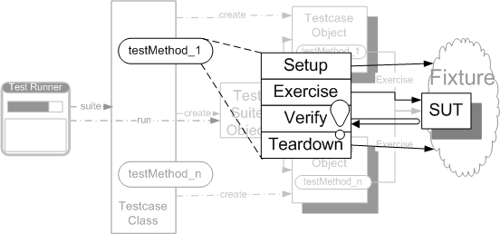

name: readability-header
layout: true

# Readability

---
template: readability-header

## Naming unit tests

Test naming is crucial for making our tests easy to find and understand.

* The name of the SUT class.
* The name of the method or feature being exercise.
* The important characteristics of any input values related to the exercising of the SUT.
* Anything relevant about the state of the SUT.

## Naming variables

Naming the variables used in unit tests is more important than naming production code ones, they must express what their intent.

---
template: readability-header

## Asserting

At some cases its useful to write an assertion text.

* Never repeat the default assert message.
* Never repeat what the name of the test already explains.
* If there is nothing to explain, do not specify a message.
* Explain what should happened or what failed.
* Never write the SUT exercise into as an assert parameter.

---
template: readability-header

## Extract Method

*Turn the fragment that can be grouped together into a method whose name explains the purpose of the method.*

```cs
public void PrintOwing(float amount){
	PrintBanner();
	Console.WriteLine("amount" + amount);
}
```
To:

```cs
public void PrintOwing(double amount) {
    PrintBanner();
    PrintDetails(amount);
}

public void PrintDetails(double amount) {
    Console.WriteLine("amount" + amount);
}
```

---
template: readability-header

## Representation

*We design each test to have four distinct phases that are executed in sequence*

1. Set up the for the SUT to exhibit the expected behavior.
2. Interact with the SUT.
3. Determine the expected output has been obtained.
4. Put the world back into the state we found it.

.readabilityimage[]

---
layout: true