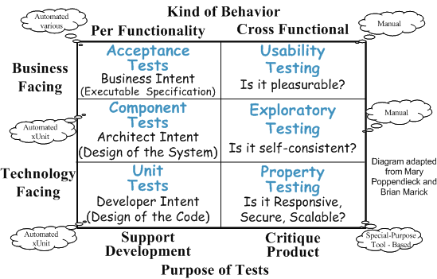

name: strategy-header
layout: true

# Strategy

---
template: strategy-header

## What Kinds of Tests Should We Automate?

.center[]

---
template: strategy-header

## Which Test Fixture Strategy Do We Use?

### What is a Fixture?

* Every test consists of **four parts** (setup/exercise/verify/teardown).
* It is **the first part**, where we create the SUT and **prepare everything to exercise it**.
* We'll use **test fixture** to mean **the preconditions of the test**.

### The Three Mayor Fixture Strategies

* Transient Fresh Fixture
	* Only Setup Code
* Persistent Fresh Fixture
	* Setup + Tear Down Code
* Shared Fixture
	* Setup/TearDown Triggering

---
layout: true