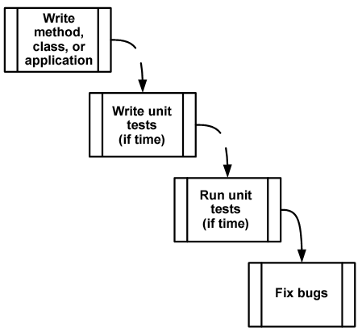
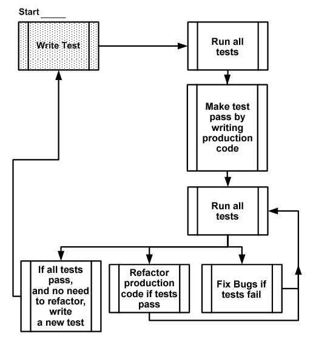

name: tdd-header
layout: true

# Test-Driven Development

---
template: tdd-header

*TDD is very much an **acquired habit**.* 

*Once one has "gotten the hang of it", writing code in any other way can seem just as strange as TDD seems to those who have never done*

---
template: tdd-header

## Traditional way of writing tests

.tddimage[]

---
template: tdd-header

## TDD way

.tddimage[]

---
template: tdd-header

## Benefits

* Earlier **detection of misunderstandings/ambiguities in requirements**
* Forces **simplification** of the code (only write code in response to the requirements of the tests)
* Forces the code to be designed for **testability**
* Saves a lot of debugging effort
* Best code **coverage**

---
layout: true